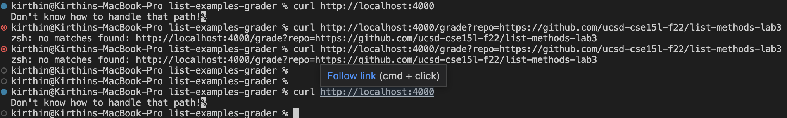

# Lab Report 5
```
set -e

rm -rf student-submission
git clone $1 student-submission


cd student-submission

if [ -f ListExamples.java ]
then
    echo "FILE FOUND"
else
    echo "FILE NOT FOUND"
    exit 1
fi

cd ..

cp TestListExamples.java student-submission
cp -r ./lib ./student-submission

cd ./student-submission

javac -cp .:lib/hamcrest-core-1.3.jar:lib/junit-4.13.2.jar *.java


if [[ $? -eq 0 ]]
then
  echo "COMPILED"
else
  echo "DID NOT COMPILE"
  exit 1
fi

java -cp .:lib/hamcrest-core-1.3.jar:lib/junit-4.13.2.jar org.junit.runner.JUnitCore TestListExamples 

if [[ $? -eq 0 ]]; then
    echo "ALL TESTS PASSES"
fi   
```


Since my server was not able to run properly and grade my tests, I will be describing what my grader should have done in each line. The first two lines recieve the student submission repository and then we go into that folder. We then check if the file was present which we do through an if statement. We then go to see if the file compiles properly with the next if statement. After that we check to see if the tests pass. If it does, it will echo the above statement.  
